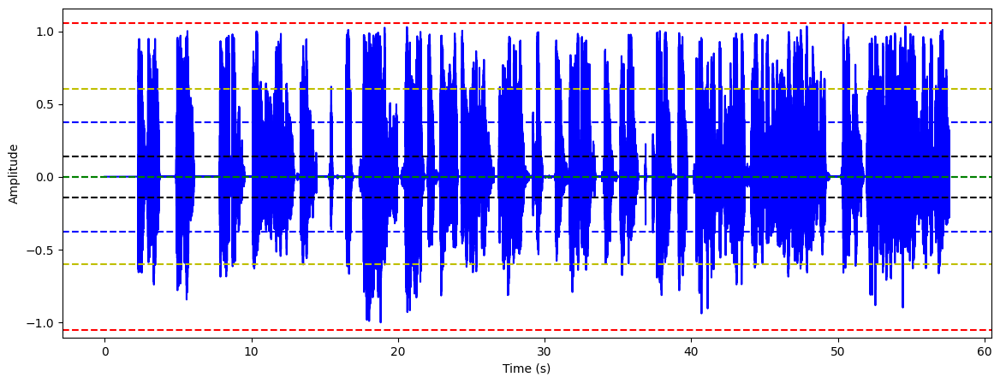

# AKTSER: Summarize Telegram Voice Messages Instantly

[](https://t.me/AktserBot)
[](https://www.docker.com/)
[](https://www.python.org/)


AKTSER is a Telegram bot that saves your time by summarizing long voice messages. It leverages advanced AI to provide concise summaries, convert voice to text, and trim silence from audio messages.

AKTSER is an arabic word that means "Summarize".


## Features

- 🔊 **Voice Message Summarization**: Get the key points without listening to the entire message.
- 📝 **Voice-to-Text Conversion**: Convert voice messages into readable text.
- ✂️ **Audio Trimming**: Remove silence and low-volume parts from voice messages.

- 🌐 **Multi-Language Support**: Understands and summarizes voice messages in multiple languages.

## Quick Start

Use AKTSER directly on Telegram:

[](https://t.me/AktserBot)


## Audio Analysis

We've conducted a thorough analysis of audio data to optimize AKTSER's performance. Check out [`analyze.ipynb`](analyze.ipynb) for insights into:

- 📊 Maximum, minimum, and average sound levels
- 📈 Standard deviation and variance of sound
- 🔍 Identifying and handling low-volume segments

Our analysis uses libraries like `librosa`, `numpy`, and `matplotlib` to process and visualize audio data. This ensures that AKTSER accurately trims silence without affecting the message content.

[](analyze.ipynb)

## Self-Hosting

### Using Docker

1. Build the Docker image:
   ```bash
   docker build -t aktser .
   ```

2. Run the container:
   ```bash
   docker run -d --name aktser aktser
   ```

3. Stop the container:
   ```bash
   docker stop aktser
   ```

4. Remove the container:
   ```bash
   docker rm aktser
   ```

   Note: Set environment variables in the `Dockerfile` before building.

### Using Python

1. Clone the repository:
   ```bash
   git clone https://github.com/fs-17/aktser.git
   cd aktser
   ```

2. Create a `.env` file with your credentials:
   ```
   BOT_NAME="AKTSER"
   BOT_TOKEN="YOUR_BOT_TOKEN"
   API_HASH="YOUR_API_HASH"
   API_ID="YOUR_API_ID"
   GOOGLE_API_KEY="YOUR_GOOGLE_API_KEY"
   ```

3. Install dependencies:
   ```bash
   pip install -r requirements.txt
   ```

4. Run the bot:
   ```bash
   python main.py
   ```

## Configuration

- **Bot Token**: Get from [@BotFather](https://t.me/BotFather)
- **API Hash & ID**: Get from [Telegram API](https://my.telegram.org/)
- **Google API Key**: Get from [Google AI Studio](https://aistudio.google.com/app/apikey)

## Commands

- `/start`: Begin interacting with AKTSER
- `/help`: Display available commands and usage
- `/summarize`: Summarize a voice message
- `/convert`: Convert a voice message to text
- `/cut`: Trim silence from a voice message

## Testing

### Summarize

[test2.ogg](assets/test2.ogg) summary:
```Markdown
## Voice Message Summary 

Subject: Test voice message for Axar

* The speaker will be talking and taking long pauses.
* _Purpose:_ To test if Axar can transcribe speech with silences.
*  The speaker will be silent while thinking to see how the transcription handles it.

## Transcription 

This is test voice for Axar. I will talk, and I will take a long silent to act as I am thinking to see if it can turn my voice.
```
---
[test1.wav](assets/test1.wav) summary:
```Markdown
## ملخص الرسالة الصوتية

الموضوع الرئيسي: نقد آراء الناس حول برنامج  (محتاج إضافة اسم البرنامج)

نقاط مهمة:

* *يعتقد البعض ان الضيوف لم يكونوا مُجهزين بشكل جيد* (محتاج توضيح هل هذا رأي صاحب الرسالة أم رأي الناس)
* *الناس لا يستمعون ولا يتابعون، فقط ينتقدون* (محتاج توضيح هل هذه وجهة نظر عامة أم رأي شخصي) 
* *يجد الضيوف مساحات أفضل لنشر معلوماتهم* (محتاج إضافة أمثلة على هذه المساحات)
* *انتشار المعلومات بشكل واسع يدل على قيمتها* (محتاج توضيح  كيف يقاس انتشار المعلومة) 

ملاحظات:

1. عدم وضوح الهدف من الرسالة. 
2. الحاجة إلى المزيد من التفاصيل:  مثل اسم البرنامج، أمثلة على المساحات الأخرى، وكيفية قياس انتشار المعلومة. 
3. ذكر أمثلة على الانتقادات الموجهة 

محتوى الرسالة:

يبدو أن الرسالة تتحدث عن انتقادات  وُجهت لبرنامج ما. يعتقد البعض أن الضيوف لم يكونوا مُجهزين بشكل جيد وأنّ الناس ينتقدون البرنامج دون الاستماع أو المتابعة.  في المقابل، يجد الضيوف  مساحات أخرى أفضل لنشر معلوماتهم  بشكل أوسع.  يرى صاحب الرسالة أن انتشار  المعلومات دليل على قيمتها.

```

### Convert
[test0.wav](assets/test0.wav) text:
```Markdown
This is test voice for Alexa I will talk and I will take a long silent to act as I am thinking to see if it can turn my voice
```

### Cut
You can listen to the trimmed audio [here](assets/), the files ending with `_cut` are the trimmed audio files.


## Contributing

We welcome contributions! For major changes, please open an issue first to discuss your ideas.

1. Fork the repository
2. Create a feature branch (`git checkout -b feature/AmazingFeature`)
3. Commit changes (`git commit -m 'Add some AmazingFeature'`)
4. Push to the branch (`git push origin feature/AmazingFeature`)
5. Open a Pull Request

## License

This project is open-source and available under the [MIT License](https://choosealicense.com/licenses/mit/).

## Acknowledgements

- [Telegram Bot API](https://core.telegram.org/bots/api)

---
Made with ❤️ by Faisal
